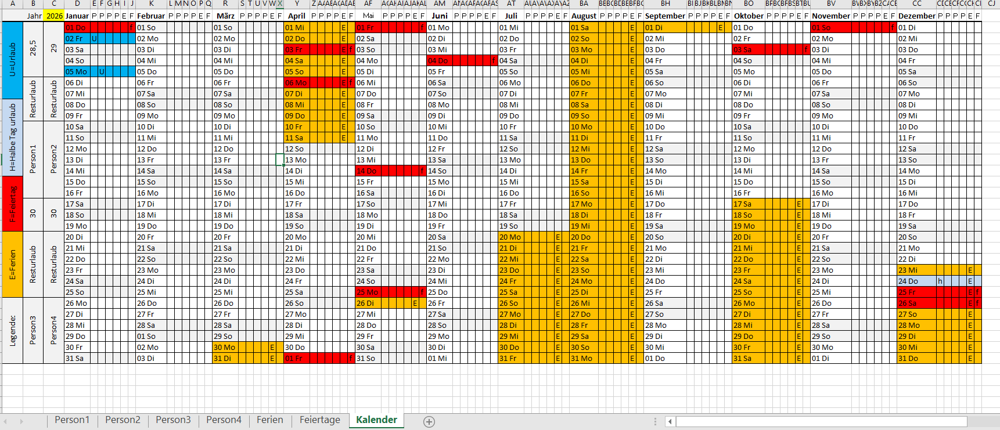
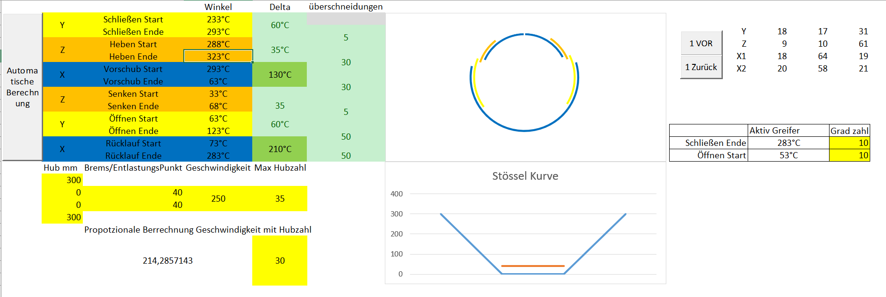
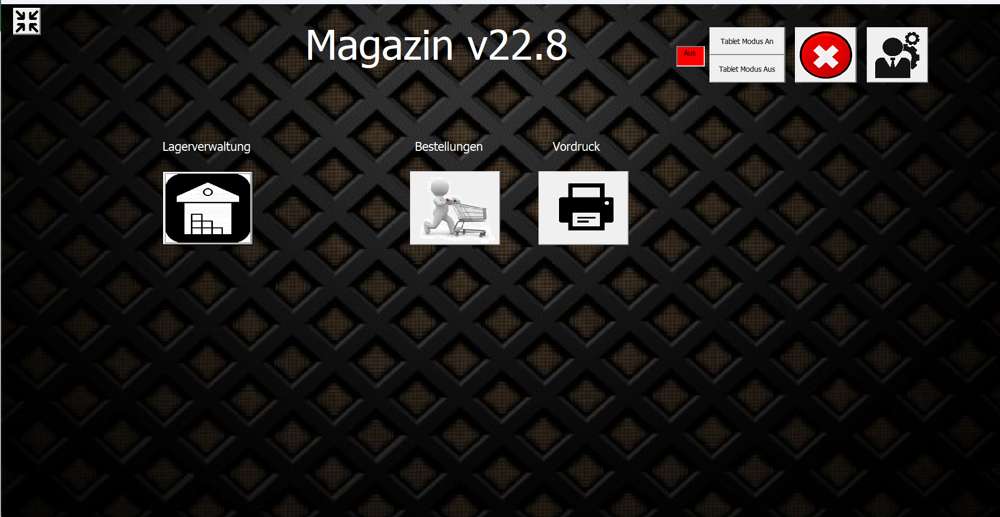
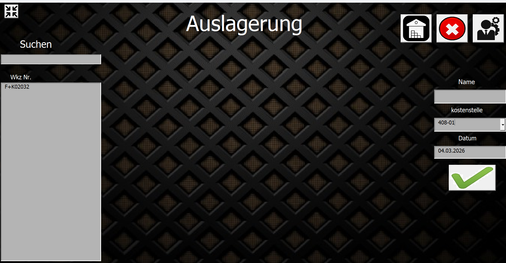
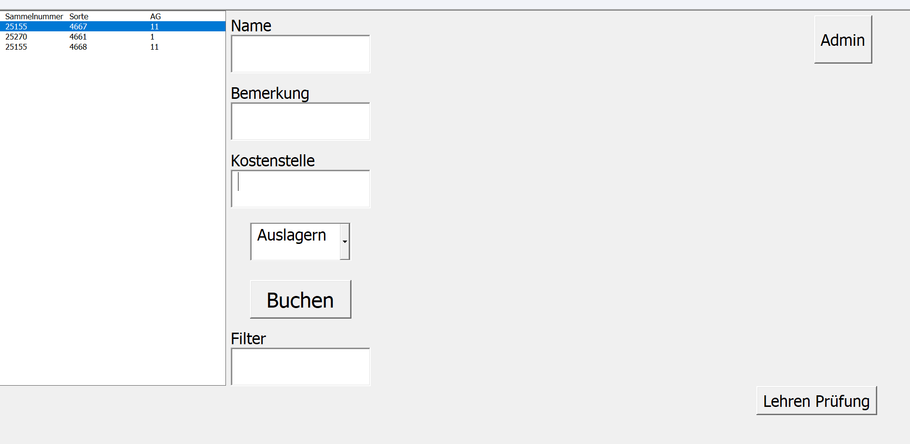
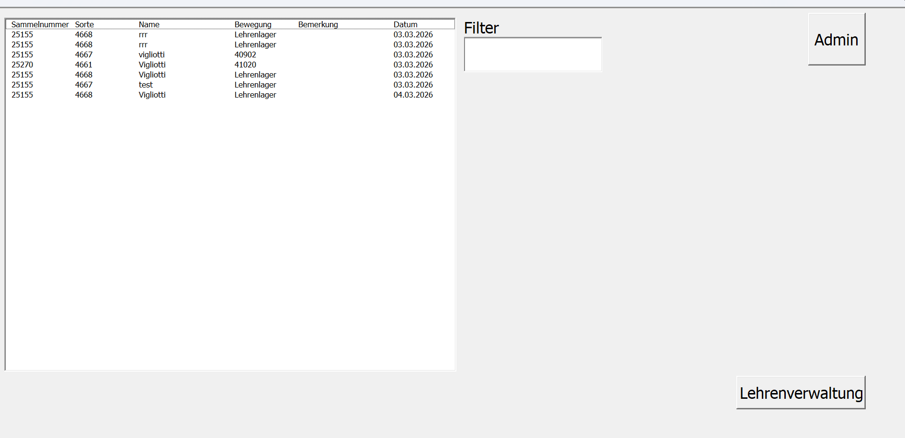
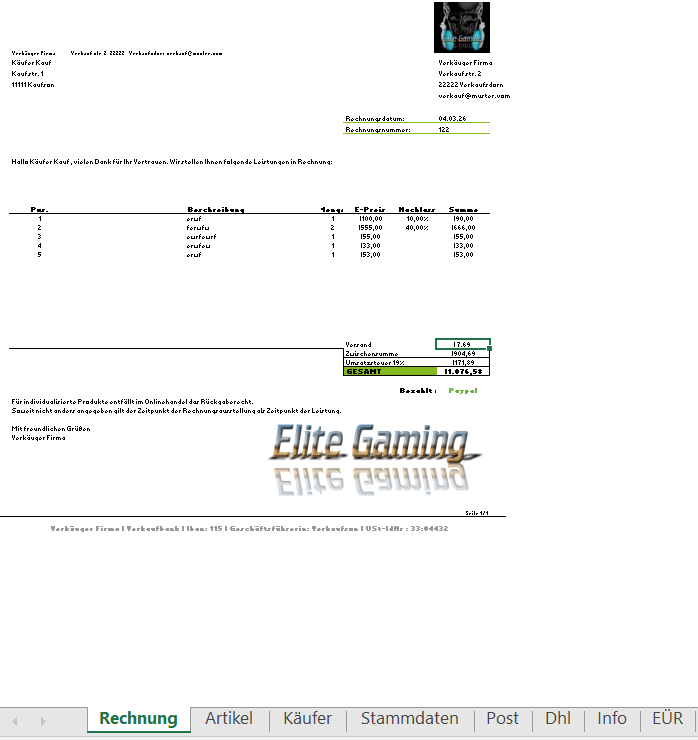
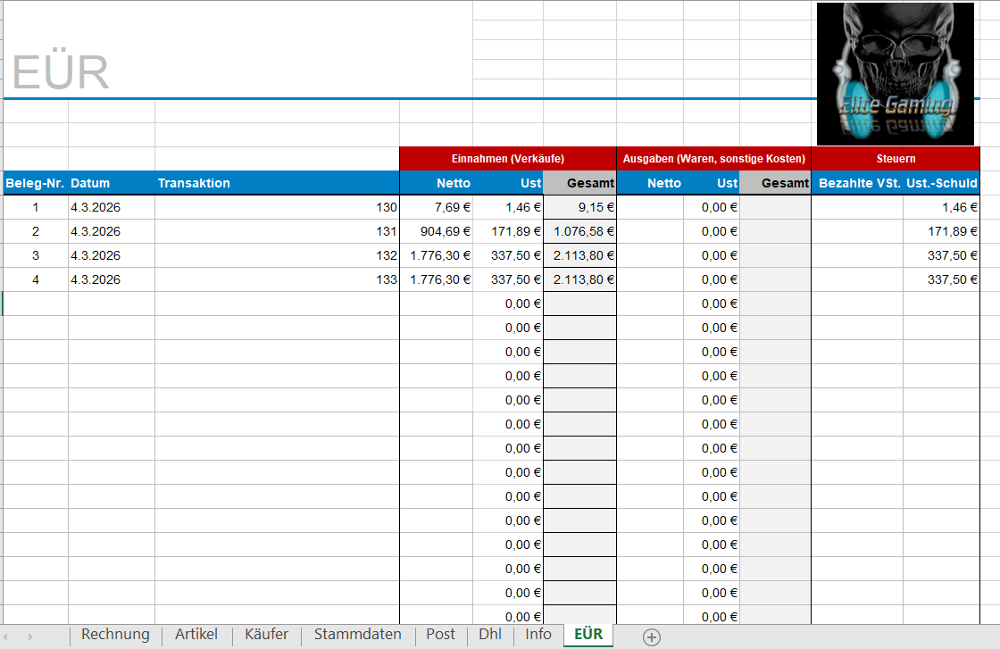

# Excel Tools für Büro, Industrie & Maschinenbau

Professionelle Excel Programme für Büro, Werkstatt, Industrie und Maschinenbau – inklusive Urlaubskalender, Kurvenberechnung, Lagerverwaltung, Lehrenverwaltung und Rechnungsprogramm.

Diese Sammlung enthält leistungsstarke Excel Programme zur Verbesserung von Organisation, Planung und Arbeitsabläufen. Alle Tools funktionieren vollständig offline mit Excel VBA.

**Ideal für:**
- Büroorganisation
- Produktionsplanung
- Maschinenbau
- Werkstätten
- Lagerverwaltung
- Werkzeugverwaltung
- Rechnungsstellung für Kleinunternehmer

---

## Download der Excel Tools

Die Programme können direkt hier heruntergeladen werden:

- [Jahreskalender_Uebersicht Download](Jahreskalender_Uebersicht.xlsm)  
- [Kurven Berechnung Download](Kurven%20Berechnung.xlsm) 
- [Magazinverwaltung Download](Magazin.xlsb & MagazinDaten.xlsb)  
- [Lehrenverwaltung Download](Lehrenverwaltung.xlsm)  
- [xlRechnung Download](xlRechnung.xlsm)  

---

## Programme Übersicht

### 1. Jahreskalender_Uebersicht

Planung von Urlaub, Ferien und Feiertagen für bis zu 4 Personen.

**Funktionen:**
- Individuelle Feiertage
- Ferien eintragbar
- Übersichtliche Darstellung mit Legende
- Ideal für Familien oder kleine Teams  

---

### 2. Kurven Berechnung für Transferpressen

Berechnung optimaler Presskurven für Transfer- und Stanzpressen.

**Vorteile:**
- Schnelle Berechnung
- Offline nutzbar
- Optimiert Produktionsabläufe
- Erhöht Hubzahlen  

---

### 3. Magazinverwaltung

  

Professionelle Lager- und Magazinverwaltung mit Benutzeroberfläche (UserForm).

**Wichtig:**  
- **Magazin.xlsb** und **MagazinDaten.xlsb** müssen zwingend in **C:\Magazin\** gespeichert werden, sonst funktioniert das Programm nicht.  

**Funktionen:**
- Anzeige wer welches Teil ausgelagert hat
- Anzeige von Lagerorten
- Tracking von Lagerbewegungen
- Reduzierung von Suchzeiten

---

### 4. Lehrenverwaltung

  

Verwaltung von Lehren und Werkzeugen mit Verlauf und Benutzeroberfläche.

**Funktionen:**
- Werkzeug Tracking
- Nutzungsverlauf
- Anzeige des letzten Benutzers
- Schnelles Finden  

---

### 5. xlRechnung

  

Rechnungsprogramm ideal für Kleinunternehmer (mit oder ohne Kleinunternehmerregelung).

**Funktionen:**
- Stammdaten einmal speichern
- Artikel und Käufer eingeben
- Rechnung generieren und automatisch in `C:\` speichern
- DHL oder Post Versandschein automatisch generiert und zum Laden bereit
- EÜR automatisch erstellt

---

## Voraussetzungen

- Microsoft Excel  
- Makros aktiviert

---

## Vorteile dieser Tools

- Vollständig offline nutzbar  
- Keine zusätzliche Software notwendig  
- Einfache Bedienung  
- Praxisorientierte Lösungen  

---
